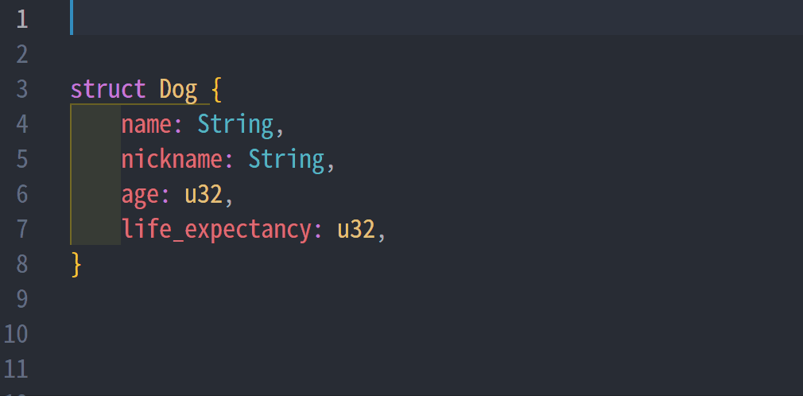

# field_accessor



With this procedural macro, you can dynamically get and update a field of the struct by a `String` type variable.
It can be good for you if you don't know which field you want when compiling. The functionality is similar to python's `getattr`, `setattr`.
## Installation

Add the crate from crates.io:

```toml
[dependencies]
field_accessor = "0.6"
```

You can also run `cargo add field_accessor` to record the current patch version automatically.

## Breaking changes in v0.6

- `FieldEnum` variants now hold references instead of owned values (for example `DogFieldEnum::name(&String)`), so pattern matches that moved the field value must be updated.
- The generated trait and inherent methods take `&str` for field names instead of `&String`. Code storing function pointers or relying on previous signatures needs to adjust.

## About this macro
This macro generates a `GetterSetter<T>` trait for the derived struct and implements it for every field type that appears in the struct. Each implementation exposes the same API, allowing you to work with any field whose type is `T`.

```rust
pub trait StructNameGetterSetter<T> {
fn get(&self, field_string: &str) -> Result<&T, String>;
fn get_mut(&mut self, field_string: &str) -> Result<&mut T, String>;
fn take(&mut self, field_string: &str) -> Result<T, String>;
fn replace(&mut self, field_string: &str, src: T) -> Result<T, String>;
fn set(&mut self, field_string: &str, value: T) -> Result<(), String>;
}

impl StructNameGetterSetter<String> for StructName { /* generated */ }
impl StructNameGetterSetter<u32> for StructName { /* generated */ }
// ...one impl per distinct field type
```

In addition to the trait implementations, the macro adds inherent methods such as `swap`, `getenum`, and `getstructinfo` on the struct itself.

### `get`
```rust
fn get(&self, field_string: &str) -> Result<&T, String>;
```
Returns an immutable reference to the requested field. You need to specify `T` (for example `let value: &String = dog.get(name)?;`) so that the compiler can pick the correct implementation.

### `get_mut`
```rust
fn get_mut(&mut self, field_string: &str) -> Result<&mut T, String>;
```
Returns a mutable reference to the field corresponding to `field_string`.

### `set`
```rust
fn set(&mut self, field_string: &str, value: T) -> Result<(), String>;
```
Replaces the field with `value` and discards the previous value.

### `take`
```rust
fn take(&mut self, field_string: &str) -> Result<T, String>;
```
Replaces the field with `T::default()` (so `T` must implement `Default`) and returns the previous value.

### `replace`
```rust
fn replace(&mut self, field_string: &str, src: T) -> Result<T, String>;
```
Moves `src` into the field and returns the previous value.

### `swap`
```rust
fn swap(&mut self, field_string: &str, field_string_y: &str) -> Result<(), String>;
```
Swaps the contents of two fields that share the same type. If the types differ, the macro does not generate a matching arm and the call fails at runtime.

### `getenum`
```rust
fn getenum(&self, field_string: &str) -> Result<StructNameFieldEnum<'_>, String>;
```
Returns the requested field wrapped in a generated enum that preserves the field's name and returns references. This avoids having to specify `T` explicitly when you need to work with heterogeneously typed fields.

### `getstructinfo`
```rust
fn getstructinfo(&self) -> StructNameStructInfo;
```
Provides metadata about the struct: the declared field names, their type names (as strings), and the struct name itself.

## Usage and Example


```rust
use field_accessor::FieldAccessor;

#[derive(FieldAccessor)]
struct Dog {
    name: String,
    age: u32,
    life_expectancy: u32,
    friends: Vec<String>,
}

fn main() {
    let mut dog = Dog {
        name: "Taro".to_string(),
        age: 3,
        life_expectancy: 9,
        friends: vec!["Mike".to_string(), "Nozomi".to_string()],
    };

    dog.set(&"name".to_string(), "Jiro".to_string()).unwrap();
    let nickname: &mut String = dog.get_mut(&"name".to_string()).unwrap();
    nickname.push_str(" the Dog");

    let age: &u32 = dog.get(&"age".to_string()).unwrap();
    println!("{} is {} years old", nickname, age);

    let previous_name: String = dog
        .replace(&"name".to_string(), "Ken".to_string())
        .unwrap();
    println!("{} used to be called {}", dog.name, previous_name);

    let removed_friends: Vec<String> = dog.take(&"friends".to_string()).unwrap();
    println!("friends: {:?}", removed_friends);

    dog.swap(&"age".to_string(), &"life_expectancy".to_string())
        .unwrap();
    println!("age={}, life_expectancy={}", dog.age, dog.life_expectancy);

    let fields = ["name", "age", "life_expectancy"];
    for field in fields.iter() {
        match dog.getenum(&field.to_string()).unwrap() {
            DogFieldEnum::name(v) => println!("name: {}", v),
            DogFieldEnum::age(v) => println!("age: {}", v),
            DogFieldEnum::life_expectancy(v) => println!("life_expectancy: {}", v),
        }
    }
}

```
### output (abridged)
```
Jiro the Dog is 3 years old
Ken used to be called Jiro the Dog
friends: ["Mike", "Nozomi"]
age=9, life_expectancy=3
name: Ken
age: 9
life_expectancy: 3
```

This code is generated at compiling.

## Known issues

You need to specify the data type of the returned value. If it is not given,
the compiler cannot infer the type. This restriction reduces the convenience of using this macro.

```rust
#[derive(FieldAccessor)]
struct Dog {
    name: String,
    age: u32,
    life_expectancy: u32,
}

let mut dog = Dog {
    name: "Taro".to_string(),
    age: 3,
    life_expectancy: 9,
};
let fields = vec![
    "name".to_string(),
    "age".to_string(),
    "life_expectancy".to_string(),
];
for field_name in fields.into_iter(){
    let fieldvalue = dog.get(&field_name).unwrap();
};
```

This code raises an error.
```
let fieldvalue = dog.get(&field_name).unwrap();
    ----------       ^^^ cannot infer type for type parameter `T` declared on the trait `GetterSetter`
    |
    consider giving `fieldvalue` the explicit type `&T`, where the type parameter `T` is specified
```

A workaround is to replace `get` with `getenum`. This macro defines `(struct name)FieldEnum<'a>` behind the scenes for you like below.
```rust
enum DogFieldEnum<'a> {
    name(&'a String),
    age(&'a u32),
    life_expectancy(&'a u32),
}
```
You can use this as a return type. With this enum you can get any field's value without concerning a field's type while still borrowing the data.
```rust
let mut dog = Dog {
    name: "Taro".to_string(),
    age: 3,
    life_expectancy: 9,
};
let fields = vec![
    "name".to_string(),
    "age".to_string(),
    "life_expectancy".to_string(),
];
let mut fieldvalues = Vec::new();
for field_name in fields.into_iter() {
    fieldvalues.push(dog.getenum(&field_name).unwrap());
}
assert!(matches!(fieldvalues[0], DogFieldEnum::name(value) if *value == "Taro"));
assert!(matches!(fieldvalues[1], DogFieldEnum::age(value) if *value == 3));
```

## Getting struct's information
You can get the information of the struct with `(field name)StructInfo` by calling `getstructinfo`.

### Definition of `(field name)StructInfo`
```rust
struct DogStructInfo {
    field_names: Vec<String>,
    field_types: Vec<String>,
    struct_name: String
}
```
### Example
```rust
let info = dog.getstructinfo();
println!("{:?}", info);
for i in info.field_names.iter() {
    let fieldvalue = dog.getenum(i).unwrap();
    println!("{:?}", fieldvalue);
}
```
#### output
```
DogStructInfo { field_names: ["name", "age", "life_expectancy"], field_types: ["String", "u32", "u32"], struct_name: "Dog" }

name("Jiro")
age(4)
life_expectancy(10)
```

## Author
Tomohiro Endo (europeanplaice@gmail.com)
